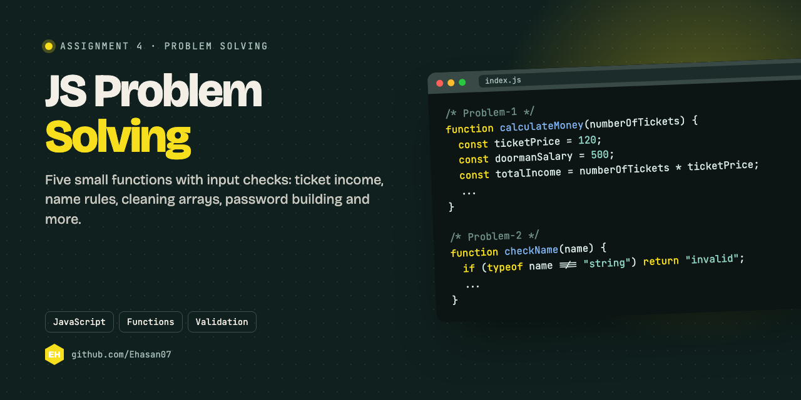

<p align="center"></p>

## About

Assignment 4: five small JavaScript functions, each checking its input before doing the work.

| # | Function | What it does |
|---|---|---|
| 1 | `calculateMoney(numberOfTickets)` | Ticket income (120 taka each) minus the doorman's and staff costs; refuses negative counts |
| 2 | `checkName(name)` | Returns *Good Name* or *Bad Name* by the last letter; *invalid* if it isn't a string |
| 3 | `deleteInvalids(arr)` | Keeps only the valid numbers in an array; errors if the input isn't an array |
| 4 | `password(obj)` | Builds `siteName#name@birthYear` from an object; *Invalid* if a field is missing |
| 5 | `monthlySavings(arr, livingCost)` | Adds up payments (20% off any of 3000 or more), takes away living cost, or says *earn more* |

## Run it

```bash
node index.js
```

Or call any function from the browser console after loading `index.js`.

---

<p align="center"><sub>Made by <a href="https://github.com/Ehasan07">S M Ehasanul Haque</a> · Dhaka, Bangladesh · <a href="https://ehasanlive.com">ehasanlive.com</a></sub></p>
